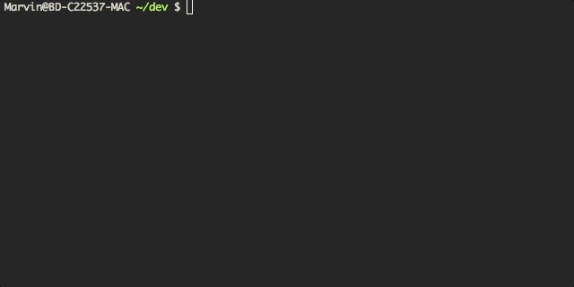

# How rich am I

How rich am I is a command line tool which calculates the € price for all your crypto currency coins.

## Usage

Create a json file to define your crypto currencies. Follow this example:

```json
[
  {
    "id": "bitcoin",
    "amount": 0.1
  },
  {
    "id": "ethereum",
    "amount": 0.1
  },
  {
    "id": "ripple",
    "amount": 0.1
  }
]
```

Please use the id value from the [coinmarketcap api](https://api.coinmarketcap.com/v1/ticker/).

